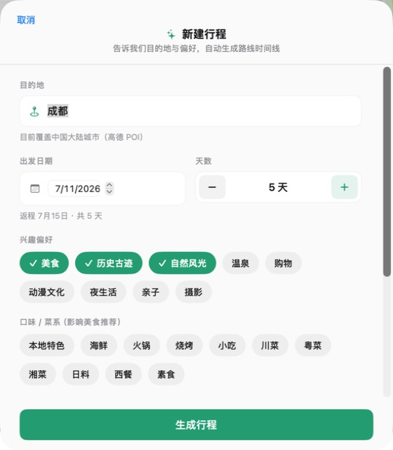
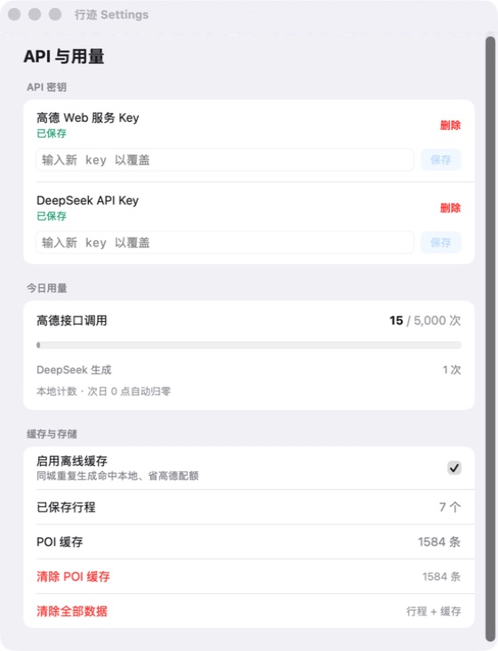

# Trailhead 当前体验审计

审计日期：2026-07-11

范围：新建行程、生成后的路线与地图、设置与用量。证据来自当前 Debug App 的实际界面；未再次调用外部 API。

## Step 1 — 新建行程（健康度：良好，有中等摩擦）

优点：信息分组清楚，标签选择状态明显，主按钮固定在底部，长表单仍能随时提交。

风险：默认 5 天会触发较重的首次请求，但界面没有预计调用量、耗时或成本提示；更多住宿、节奏、预算选项位于折叠视野下方，用户不一定知道还需继续滚动。浅灰辅助文字和未选标签的对比度需要实测。

## Step 2 — 生成结果与地图（健康度：核心可用，但存在高优先级可信度问题）

优点：三栏结构适合桌面旅行规划，行程、候选推荐和地图能同时比较；卡片提供评分、价格、图片和外部详情入口。

风险：当前苏州结果中，金鸡湖到石路餐厅之间没有交通卡片，用户会误以为两处自然连续；代码在真实路线请求失败时会静默返回 `nil` 并跳过交通段。详情显示选中“金鸡湖景区”，但地图视野和高亮落在苏州西部推荐餐厅附近，选择与地图焦点的可信度不足。住宿候选出现张家港、昆山，说明排序只看评分/偏好/价格，没有按市中心或当天路线距离收敛。推荐清单很长，明显压过当天主路线。

## Step 3 — 设置与用量（健康度：清楚、安全感较好）

优点：密钥只显示状态，不回显内容；用量、缓存和本地数据规模集中展示，危险操作使用红色并有二次确认。

风险：“已保存”不代表密钥仍有效，缺少“测试连接”和最近验证时间；DeepSeek 只展示调用次数，没有 token 或成本；Keychain 写入和清理操作目前忽略底层错误，失败时用户可能没有明确反馈。

## 建议优先级

1. P0：任何两站之间都必须存在交通信息。真实路线失败时展示估算交通卡和“待联网校准”标识，不允许静默断链。
2. P0：修正列表选择、地图中心、高亮标记的单一状态源，并增加回归测试。
3. P1：住宿按目的地中心、当天点位或用户指定住宿区域做距离过滤；张家港、昆山等远郊候选默认排除。
4. P1：把附近美食和住宿改为折叠区或 Top 3，主路线始终优先；标明“路线内”与“备选推荐”。
5. P1：设置页增加高德/DeepSeek“测试连接”、最近成功时间和可读错误；DeepSeek 增加 token/费用估算。
6. P1：把已有 `GenerationDiagnostics` 做成开发诊断页，记录召回数、缓存命中、路线失败/降级、LLM 耗时与最终删点原因。
7. P2：生成前显示预计耗时、调用量，失败后保留表单并允许只重试失败阶段。
8. P2：补键盘与 VoiceOver 审计；标签应作为有选中状态的按钮/Toggle 暴露，图标按钮使用自然语言标签，并验证浅灰文字和小图标目标尺寸。

## 证据限制

本次基于 macOS 当前窗口与辅助功能树，没有覆盖 iOS、小窗口重排、深色模式、动态字体、完整键盘遍历或 VoiceOver 实听，因此不能据此声称完整无障碍合规。

## 实施计划

按 P0 → P2 拆分的工程任务、验收条件与建议批次见：[`../../plans/2026-07-11-trailhead-hardening-plan.md`](../../plans/2026-07-11-trailhead-hardening-plan.md)。
